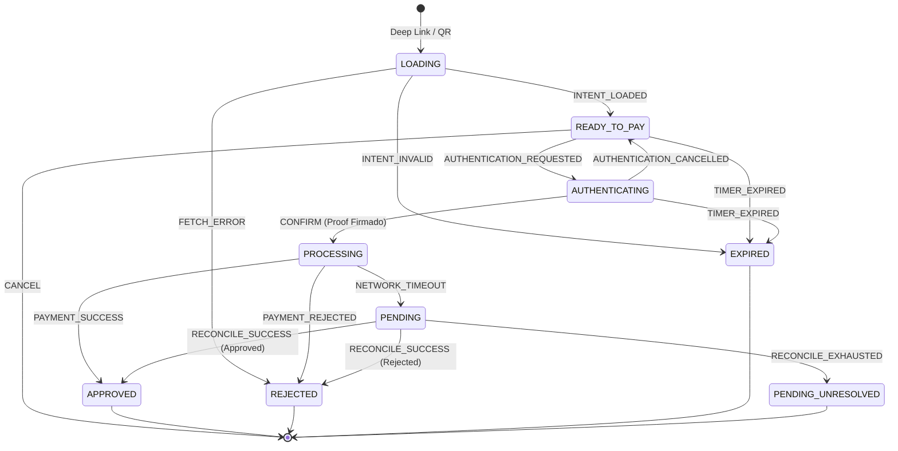
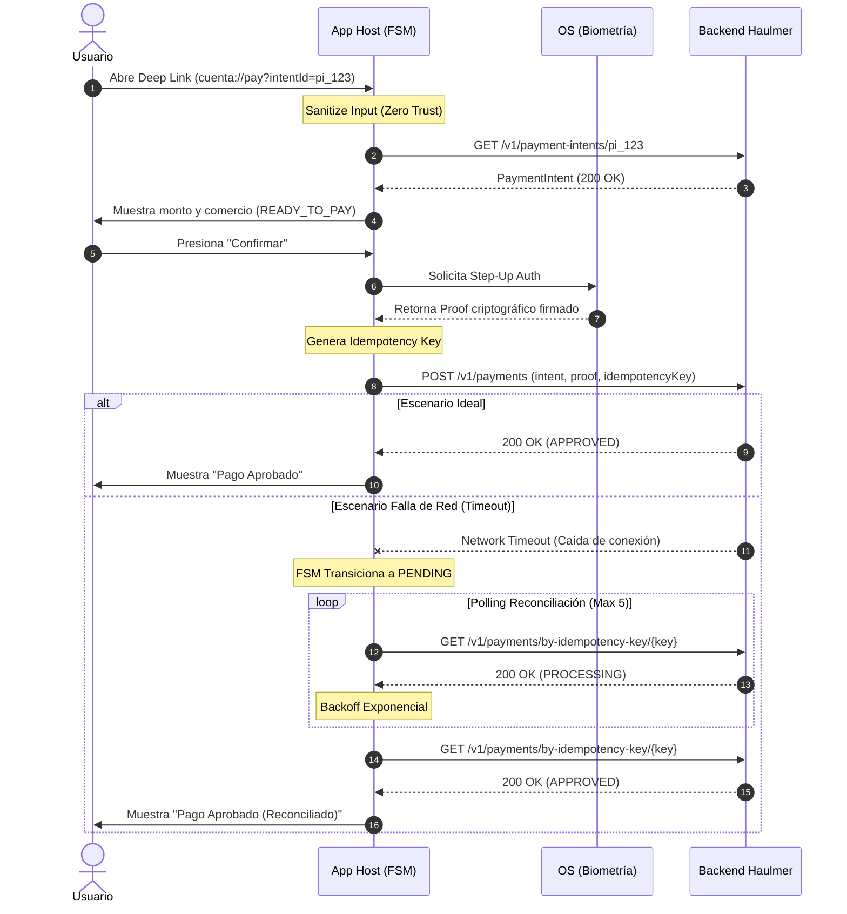

# RFC-0001: Arquitectura Mobile Objetivo — SuperApp Haulmer

**Autor:** Pedro Muñoz López
**Fecha:** Agosto 2026
**Estado:** Borrador — Revisión Requerida
**Contexto:** Desafío Técnico Staff Engineer Mobile

---

## 0. TL;DR

Adoptamos un **Monorepo Modular** (Feature-Sliced Design) sobre **React Native bare workflow + TypeScript**, con límites de módulo aplicados en tiempo de compilación. El flujo de pago A2A/QR se implementa como un **thin slice** vertical que demuestra: máquina de estados finitos (FSM) para los 6 estados observables del pago exigidos por el desafío (listo para confirmar, procesando, aprobado, pendiente, expirado, rechazado), más dos estados transicionales internos sin pantalla propia (carga inicial y autenticación nativa); idempotencia + reconciliación para tolerancia a fallos de red; y un modelo Zero Trust donde el dispositivo y toda entrada externa son datos no confiables.

---

## 1. Contexto y Problema

Haulmer está construyendo una SuperApp que consumirá capacidades financieras ya disponibles (identidad/KYC, cuentas, saldos, transferencias) e incorporará nuevas experiencias de consumidor, loyalty, pagos A2A/QR y, a futuro, un marketplace de miniapps.

**Fuerzas en tensión que este RFC debe resolver:**

| Fuerza | Descripción |
|--------|-------------|
| Velocidad vs. Deuda | Etapa temprana requiere iterar rápido, pero las decisiones de arquitectura en fintech tienen costo alto si se revierten |
| Aislamiento vs. Colaboración | Múltiples squads en paralelo sin degradar seguridad ni experiencia |
| Confiabilidad vs. Simplicidad | Flujos monetarios exigen tolerancia a fallos; la complejidad accidental los mata |
| Extensibilidad vs. Over-engineering | Miniapps son un objetivo futuro; no debemos construirlas hoy pero tampoco imposibilitarlas |

**Fuera de scope de este RFC:**
- Integración con cámara QR real (se usa payload simulado)
- Backend real (se usan mocks)
- Módulos de Loyalty y Consumer (se definen sus límites, no su implementación)

---

## 2. Decisiones de Arquitectura (ADRs)

### ADR-01: Monorepo Modular vs. Repositorios Separados vs. MFE dinámicos

**Decisión: Monorepo Modular con límites estrictos aplicados por ESLint (`import/no-restricted-paths`).**

**Alternativas consideradas:**

| Alternativa | Ventaja | Desventajas: ¿Por qué se descarta? |
|-------------|---------|---------------------|
| Repos separados por dominio | Aislamiento total de equipos | Overhead de sincronización de versiones entre repos; tipado cross-repo débil; imposibilita refactorizaciones transversales seguras |
| Micro-frontends dinámicos (Re.Pack / Module Federation) | Deploys independientes por squad | Infraestructura DevOps compleja desde el día 1; herramientas React Native inmaduras; bundling independiente introduce riesgos de versiones incompatibles en runtime |
| Monorepo Monolítico (sin límites) | Simplicidad máxima | No escala con múltiples squads; un squad puede romper el build de otro; sin contrato explícito entre módulos |

**Consecuencias aceptadas:** El monorepo requiere reglas de CI que validen los límites de importación. Esto es trabajo de plataforma, no de producto.

---

### ADR-02: Estado Global — Zustand vs. Redux Toolkit vs. React Context

**Decisión: Zustand para estado de UI ligero; estado crítico de flujos financieros encapsulado en FSM (XState o reducer estricto), no en store global.**

**Razonamiento:** El estado de un pago en curso no debe ser accesible desde cualquier módulo. La FSM es la única fuente de verdad del flujo, y su encapsulamiento previene mutaciones accidentales desde capas de UI.

---

### ADR-02b: Server State — Fetch directo vs. React Query/TanStack Query

**Decisión: Fetch directo dentro de los actores/servicios invocados por la FSM, sin capa de cache (React Query u otra) para el dominio de pagos.**

**Razonamiento:** Los datos financieros del flujo de pago (`payment-intents`, `payments`) son de un solo uso por transacción y deben ser siempre autoritativos y frescos — cachear un `PaymentIntent` introduce el riesgo de mostrar un monto o estado obsoleto justo antes de confirmar. Una librería de cache añadiría complejidad sin beneficio en este dominio específico.

**Alcance de esta decisión:** limitada a `@haulmer/payments`. Otros dominios (`banking`, `loyalty`, `consumer`) sí pueden adoptar React Query para listas, históricos y datos no transaccionales, donde el cache sí aporta valor (reducción de requests, estados de loading/error consistentes). Esto se deja como decisión de cada squad dueño del package, no impuesta por `core`.

---

### ADR-03: Navegación — React Navigation vs. Expo Router

**Decisión: React Navigation v7 con deep link handling centralizado en el App Host.**

**Razonamiento:** Expo Router introduce opiniones de routing basadas en filesystem que complican la separación de módulos. Con React Navigation, el App Host controla explícitamente qué módulos registran qué rutas, preservando los límites de ownership.

---

### ADR-04: Stack React Native — Bare Workflow vs. Expo Managed

**Decisión: React Native bare workflow (react-native-cli) en esta etapa, con clara estrategia de migración a Expo en futuro.**

**Alternativas consideradas:**

| Alternativa | Ventaja | Por qué se descarta (ahora) | Cuándo reconsiderar |
|-------------|---------|---|---|
| **Expo Managed** | Desarrollo rápido, servicios integrados (OTA updates, push notifications) | Decisiones predeterminadas limitarían customizaciones nativas futuras (biometría hardware, secure storage); monorepo + workspaces requiere configuración no estándar en Expo | Fase 4+ cuando features nativas están estabilizadas |
| **Bare Workflow** | Control total, customizaciones nativas desde día 1, pod install / gradle config explícito | Overhead inicial de setup nativo, requiere coordinación iOS/Android | Ahora — queremos precisión en integración nativa |

**Consecuencias aceptadas:**
- **Setup inicial más complejo** — requiere Xcode, Android Studio, CocoaPods, Gradle
- **Configuración nativa explícita** — ios/ y android/ folders no ignorados
- **Migración Expo posterior es viable** — `expo prebuild` puede convertir bare a Managed si decidimos

**Por qué bare workflow es correcto para Haulmer ahora:**

1. **Biometría + Secure Storage nativas** — BiometricAdapter necesita LocalAuthentication (iOS) y BiometricPrompt (Android). Expo trae restricciones.
2. **Zero Trust model** — Keychain/Keystore acceso explícito. Expo managed puede ofuscar esto.
3. **Feature flags + Kill Switch** — Control de compilación nativa (BuildConfig, Info.plist).
4. **Monorepo escalable** — Las decisiones de bare workflow permiten workspaces sin fricción.

**Ruta de migración a Expo (Fase 4+):**

```

Bare Workflow (ahora)
↓ (Feature flags + telemetría estabilizadas)
↓ (Biometría + secure storage en producción)
↓ (OTA updates + push requeridas)
Expo Managed (expo prebuild)
↓ (Managed workflow con capacidades nativas)
↓ (EAS Build para CI/CD)

```

---

## 3. Estructura del Monorepo


```

haulmer-superapp/
├── apps/
│   └── mobile/                    # App Host (@haulmer/app)
│       ├── src/
│       │   ├── navigation/        # Root navigator + deep link config
│       │   └── native/            # Inicialización, registro de módulos
│       └── index.js
│
├── packages/
│   ├── core/                      # @haulmer/core — PROPIEDAD: Platform Squad
│   │   └── src/
│   │       ├── network/           # HttpClient base con interceptores
│   │       ├── security/          # BiometricAdapter, SecureStorage
│   │       └── observability/     # Logger, ErrorReporter (con PII redaction)
│   │
│   ├── identity/                  # @haulmer/identity — PROPIEDAD: Identity Squad
│   │   └── (KYC, onboarding, tokens)
│   │
│   ├── banking/                   # @haulmer/banking — PROPIEDAD: Banking Squad
│   │   └── (saldos, transferencias clásicas)
│   │
│   ├── payments/                  # @haulmer/payments — PROPIEDAD: Payments Squad
│   │   └── src/
│   │       ├── api/               # Contratos de red del dominio
│   │       ├── fsm/               # PaymentFlowMachine (FSM del pago QR)
│   │       ├── screens/           # UI del flujo
│   │       └── __tests__/         # Tests de escenarios críticos
│   │
│   ├── loyalty/                    # @haulmer/loyalty — PROPIEDAD: Loyalty Squad — RESERVADO (no implementar aún)
│   │   └── (puntos, recompensas, catálogo de beneficios)
│   │
│   ├── consumer/                   # @haulmer/consumer — PROPIEDAD: Consumer Squad — RESERVADO (no implementar aún)
│   │   └── (home, descubrimiento, perfil, experiencias no-transaccionales)
│   │
│   └── mini-apps/                 # @haulmer/mini-apps — RESERVADO (no implementar aún)
│       └── (WebView segura, contratos de extensión futura)
│
└── tools/
├── eslint-config/             # Reglas de límites de importación
└── tsconfig/                  # Configs base compartidas

```

### 3.1 Reglas de Dependencia (aplicadas por CI)


```

@haulmer/app         → puede importar TODOS los packages
@haulmer/payments    → puede importar: core, identity, banking
@haulmer/loyalty     → puede importar: core, identity, banking
@haulmer/consumer    → puede importar: core, identity, banking, payments, loyalty (solo vía sus public APIs)
@haulmer/identity    → puede importar: core
@haulmer/banking     → puede importar: core
@haulmer/core        → NO puede importar otros packages de dominio

```

**Regla crítica:** Los packages de dominio transaccionales (`payments`, `loyalty`, `identity`, `banking`) están prohibidos de importarse entre sí. Si necesitan compartir algo, ese algo pertenece a `core`. La única excepción es `@haulmer/consumer`, cuyo rol es agregar experiencias de otros dominios en un home — puede importar `payments` y `loyalty`, pero únicamente a través de sus `index.ts` públicas, nunca de sus internals, y esto se valida en CI igual que el resto de los límites.

---

## 4. Flujo de Pago A2A/QR — Thin Slice

### 4.1 Máquina de Estados Finitos (FSM)

El flujo de pago expone **6 estados observables** al usuario — uno por cada pantalla dedicada del negocio (`READY_TO_PAY`, `PROCESSING`, `APPROVED`, `PENDING`, `EXPIRED`, `REJECTED`), que son exactamente los exigidos por el enunciado. La FSM completa modela además **2 estados transicionales sin pantalla propia**: `LOADING` (spinner genérico mientras se resuelve el intent, antes de que exista algo que confirmar) y `AUTHENTICATING` (delegado a la UI nativa de biometría/PIN del sistema operativo, no a un screen de React Native). Por eso el diagrama tiene 8 nodos pero el requerimiento de negocio de "6 estados observables" se cumple sin ambigüedad. Ninguna regla booleana dispersa (`isLoading`, `isError`) es aceptable en este dominio.



**Transiciones válidas — tabla completa:**

| Estado Origen | Evento | Estado Destino | Condición |
| --- | --- | --- | --- |
| `LOADING` | `INTENT_LOADED` | `READY_TO_PAY` | intentId válido, `status === "READY"` |
| `LOADING` | `INTENT_INVALID` | `EXPIRED` | `expiresAt` en el pasado, status ≠ READY |
| `LOADING` | `FETCH_ERROR` | `REJECTED` | Error de red irrecuperable |
| `READY_TO_PAY` | `TIMER_EXPIRED` | `EXPIRED` | countdown llega a 0 |
| `READY_TO_PAY` | `AUTHENTICATION_REQUESTED` | `AUTHENTICATING` | usuario presiona "Confirmar" |
| `READY_TO_PAY` | `CANCEL` | `(terminal: navegación atrás)` | usuario cancela |
| `AUTHENTICATING` | `CONFIRM` | `PROCESSING` | requiere `authProof` firmado en el propio evento (ver 4.5) |
| `PROCESSING` | `PAYMENT_SUCCESS` | `APPROVED` | servidor retorna 2xx |
| `PROCESSING` | `PAYMENT_REJECTED` | `REJECTED` | servidor retorna 4xx |
| `PROCESSING` | `NETWORK_TIMEOUT` | `PENDING` | timeout o error de red post-POST |
| `PENDING` | `RECONCILE_SUCCESS` | `APPROVED` o `REJECTED` | según resultado del reconcile |
| `PENDING` | `RECONCILE_EXHAUSTED` | `PENDING_UNRESOLVED` (terminal) | tras N reintentos sin respuesta definitiva |

**Regla estricta de negocio:** El evento `CONFIRM` **solo es procesado si el estado actual es `AUTHENTICATING`**, y el propio tipo del evento exige un `authProof: StepUpProof` — no es posible construir un `CONFIRM` sin la prueba de step-up. En cualquier otro estado, el evento es descartado sin efecto. Esto elimina dos problemas a la vez: el doble tap (algorítmicamente, sin debounces en la UI) y la posibilidad de confirmar un pago sin autenticación real (a nivel de tipos, no solo de convención de UI).

> **Nota de corrección:** una versión anterior de esta tabla tenía una fila `READY_TO_PAY | CONFIRM | PROCESSING`, inconsistente con el diagrama Mermaid de arriba (donde la única arista hacia `PROCESSING` siempre salió de `AUTHENTICATING`). Esa fila permitía, en teoría, confirmar un pago sin pasar por step-up. Se corrige aquí para que la tabla sea fiel al diagrama.

---

### 4.2 Contrato de Red y Optimistic Locking

Se utiliza el contrato de referencia del enunciado sin modificaciones. El campo `version` implementa **Optimistic Locking**: el cliente envía `expectedVersion` en el POST para que el servidor rechace pagos sobre un intent que haya cambiado de estado concurrentemente.

```typescript
// GET /v1/payment-intents/{intentId}
interface PaymentIntent {
  id: string;
  merchant: { id: string; displayName: string };
  amount: number;          // centavos o unidad mínima de CLP
  currency: "CLP";
  expiresAt: string;       // ISO-8601 UTC
  status: "READY" | "EXPIRED" | "COMPLETED" | "CANCELLED";
  version: number;         // Optimistic Lock Version
}

// POST /v1/payments
interface ConfirmPaymentRequest {
  intentId: string;
  expectedVersion: number;    // debe coincidir con version del GET
  idempotencyKey: string;     // hash determinístico (SHA-256, truncado a 32 hex), estable entre sesiones
  deviceId: string;           // bound device ID desde SecureStorage
  authProof: string;          // firma opaca del step-up
}

// GET /v1/payments/by-idempotency-key/{key}  — reconciliación
interface ReconcileResponse {
  status: "APPROVED" | "REJECTED" | "PROCESSING";
  paymentId?: string;
}

```

**Por qué `idempotencyKey` se genera al montar y no al confirmar:** Si el usuario abre la pantalla, cierra la app, y la reabre con el mismo deep link, el key debe ser el mismo para que el servidor reconozca el intento previo. La estrategia es: `idempotencyKey = SHA256(intentId + deviceId + sessionDate)` (sin incluir datos PII) — no un UUID v4, que por definición es aleatorio y no cumpliría el requisito de estabilidad. Al ser determinístico, el cliente puede recalcularlo en cualquier momento (incluyendo tras un cierre y reapertura de la app) sin necesidad de persistirlo.

---

### 4.3 Algoritmo de Reconciliación

Cuando el estado es `PENDING` (timeout post-POST):

```
MAX_ATTEMPTS = 5
BACKOFF = [1s, 2s, 4s, 8s, 16s]  // exponencial, capped a 16s

Para cada intento i en [1..MAX_ATTEMPTS]:
  resultado = GET /v1/payments/by-idempotency-key/{key}
  
  si resultado.status in ["APPROVED", "REJECTED"]:
    → transicionar FSM al estado correspondiente
    → terminar

  si i < MAX_ATTEMPTS:
    → esperar BACKOFF[i]
  
  si i == MAX_ATTEMPTS y estado sigue siendo "PROCESSING":
    → FSM transiciona a PENDING_UNRESOLVED (estado terminal, distinto de PENDING)
    → Mostrar UI: "Tu pago está siendo procesado. Revisa tu historial en unos minutos."
    → Registrar evento de telemetría con x-correlation-id para investigación manual

```

**Regla estricta de seguridad:** Nunca se intenta un segundo `POST /v1/payments`. La reconciliación es exclusivamente de lectura (GET). La idempotencia en el servidor es la garantía contra duplicados, no la lógica del cliente.

**Por qué `PENDING_UNRESOLVED` es un estado distinto de `PENDING`:** reusar `PENDING` para "todavía reintentando" y para "agotó reintentos, necesita intervención manual" haría indistinguibles dos situaciones muy diferentes en telemetría y en la UI — una necesita que el usuario espere, la otra necesita soporte o revisión manual. Separarlos permite alertar y priorizar casos reales en un dashboard de operación.

### 4.3.1 Recuperación tras cierre de la app durante PENDING

El `idempotencyKey` no se persiste porque es determinístico (ver 4.2), pero la app necesita saber que existe un pago en curso si el usuario cierra la app mientras está en `PENDING` (o incluso en `PROCESSING`, sin saber si el POST llegó a salir) y no vuelve a abrir el mismo deep link.

**Mecanismo:** al iniciar la app (cold start), `@haulmer/payments` consulta `GET /v1/payments/in-flight?deviceId={deviceId}` — un endpoint que devuelve cualquier pago en estado `PROCESSING` asociado al device en las últimas N horas. Si existe uno, la FSM arranca directamente en `PENDING` con el `idempotencyKey` recalculado, y reanuda el polling de reconciliación.

**Regla:** ante la duda de si un POST llegó a salir del dispositivo, se asume que sí y se reconcilia — nunca se descarta silenciosamente un intento de pago solo por incertidumbre de red.

**Fuera de scope de este RFC:** el endpoint `in-flight` no existe en el contrato de referencia; se documenta como supuesto a validar con el equipo de backend antes de producción. Como mitigación complementaria, el backend debería disparar una notificación push cuando el pago se resuelva, para no depender únicamente de que el usuario reabra la app.

### Visualización del Flujo y Reconciliación



---

### 4.4 Deep Link Handling — Validación de Entrada No Confiable

```typescript
// En App Host — NavigationContainer linking config
const linking = {
  prefixes: ['cuenta://'],    // solo scheme autorizado
  config: { screens: { PaymentFlow: 'pay' } }
};

// En el módulo payments — primera acción al recibir el intent
function sanitizeDeepLinkParams(params: Record<string, unknown>): string {
  const intentId = params?.intentId;
  
  // Validación estricta: solo formato pi_[alfanumérico]
  if (typeof intentId !== 'string' || !/^pi_[a-zA-Z0-9]+$/.test(intentId)) {
    throw new InvalidIntentIdError('intentId no cumple formato esperado');
  }
  
  return intentId; // solo el ID — NUNCA usamos monto/comercio del deep link
}

```

**Regla de oro:** El deep link solo aporta el `intentId`. **Todo lo demás** (monto, comercio, expiración) se obtiene del servidor. Mostrar datos del QR/deep link directamente en la pantalla de confirmación es una vulnerabilidad de seguridad (QR injection).

---

### 4.5 Autenticación Step-Up

La abstracción oculta la implementación nativa detrás de una interfaz testeable:

```typescript
// Contrato — packages/core/security/BiometricAdapter.ts
interface BiometricAdapter {
  /**
   * Retorna un proof opaco firmado con la clave privada del dispositivo.
   * No retorna boolean — un boolean puede ser manipulado en memoria.
   * Lanza BiometricCancelledError | BiometricUnavailableError en caso de fallo.
   */
  requestStepUpProof(challenge: string): Promise<StepUpProof>;
}

type StepUpProof = { token: string; algorithm: 'ES256'; expiresAt: number };

// El evento CONFIRM de la FSM exige el proof en su propio tipo — no es posible
// construir el evento sin él, por lo que confirmar sin step-up deja de ser
// representable, no solo una convención de la UI:
// { type: 'CONFIRM'; authProof: StepUpProof }

// Implementación simulada para el thin slice
class MockBiometricAdapter implements BiometricAdapter {
  async requestStepUpProof(challenge: string): Promise<StepUpProof> {
    await simulateDelay(800); // simula latencia de biometría
    return { token: `mock_proof_${challenge}`, algorithm: 'ES256', expiresAt: Date.now() + 60_000 };
  }
}

```

---

## 5. Modelo de Seguridad

### 5.1 Capas de Trust Boundaries

```
┌─────────────────────────────────────────────────────────────┐
│  UNTRUSTED ZONE                                             │
│  - Deep links / QR payload                                  │
│  - Cualquier parámetro de URL                               │
│  - Respuestas de red (validar schema antes de usar)         │
└───────────────────────────┬─────────────────────────────────┘
                            │ validación + fetch autoritativo
┌───────────────────────────▼─────────────────────────────────┐
│  APP ZONE (semi-trusted)                                    │
│  - Estado en memoria (React / FSM)                          │
│  - Bundle JS (puede ser inspeccionado)                      │
└───────────────────────────┬─────────────────────────────────┘
                            │ step-up proof firmado
┌───────────────────────────▼─────────────────────────────────┐
│  HARDWARE ZONE (trusted)                                    │
│  - Keychain (iOS) / Keystore (Android)                      │
│  - Clave privada del dispositivo (no exportable)            │
│  - deviceId binding                                         │
└─────────────────────────────────────────────────────────────┘

```

### 5.2 Prevención de Fuga de PII

**Screenshot protection:**

```typescript
// Android: FLAG_SECURE en el Activity — en MainActivity.kt
window.addFlags(WindowManager.LayoutParams.FLAG_SECURE)

// iOS: overlay opaco en applicationWillResignActive
// Se monta un view opaco sobre la pantalla antes de que el sistema tome el screenshot del App Switcher

```

**Log Redaction:**

```typescript
// packages/core/observability/logger.ts
const REDACTED_FIELDS = ['amount', 'accountNumber', 'rut', 'name', 'authProof'];

function redact(obj: Record<string, unknown>): Record<string, unknown> {
  return Object.fromEntries(
    Object.entries(obj).map(([k, v]) => [
      k,
      REDACTED_FIELDS.includes(k) ? '[REDACTED]' : v
    ])
  );
}

```

### 5.3 Almacenamiento Seguro

| Dato | Storage | Justificación |
| --- | --- | --- |
| JWT / Refresh Token | Keychain/Keystore | Hardware-backed, no accesible desde otras apps |
| deviceId | Keychain/Keystore | Bound al dispositivo, debe sobrevivir reinstalaciones |
| idempotencyKey en curso | Memory (FSM state) | No necesita persistir entre sesiones |
| Preferencias de UI | AsyncStorage | No sensible |

**Prohibición explícita:** `AsyncStorage` está prohibido para cualquier dato de identidad o financiero. Esto se enforcea con una regla ESLint personalizada en el monorepo.

---

## 6. Observabilidad

### 6.1 Trazabilidad Distribuida

Cada request HTTP incluye:

```
x-correlation-id: <UUID de generado pago por sesión v4>
x-request-id: <UUID individual por request v4>
x-client-version: <semver del bundle>

```

El `x-correlation-id` es el mismo a través de todo el flujo de un pago (GET intent → POST payment → GET reconcile), permitiendo reconstruir la secuencia completa en el backend.

### 6.2 Eventos Clave a Instrumentar

| Evento | Propósito |
| --- | --- |
| `payment_flow_started` | Funnel de conversión |
| `payment_intent_loaded` | Latencia del primer fetch |
| `step_up_completed` | Tasa de éxito de biometría |
| `payment_submitted` | Tasa de submit |
| `payment_reconcile_triggered` | Frecuencia de fallos de red post-submit |
| `payment_result` `{status}` | Resultado final del flujo |

**Regla:** Ningún evento de telemetría incluye `amount`, `merchantId`, `accountNumber` ni ningún dato que permita reconstruir información financiera de un usuario individual.

### 6.3 Feature Flags y Kill Switch

Todas las funcionalidades nuevas se envuelven en flags remotos:

```typescript
if (await FeatureFlags.isEnabled('payments.qr_flow')) {
  // flujo QR habilitado
}

```

El Kill Switch de pagos QR puede activarse en tiempo real sin deploy, degradando la app con gracia (el usuario ve un mensaje de mantenimiento en lugar de un crash).

---

## 7. Estrategia de Testing — Escenarios de Riesgo

No buscamos cobertura del 100%. Testeamos los escenarios donde un bug cuesta dinero real:

| Escenario | Tipo de Test | Qué valida |
| --- | --- | --- |
| Usuario toca "Confirmar" dos veces en < 100ms | Unit (FSM) | El segundo evento es descartado; solo un POST enviado |
| Red falla después de que el servidor procesó el pago | Integration (mock) | Estado transiciona a PENDING, reconciliación activa, no hay segundo POST |
| `expiresAt` llega a cero mientras el usuario está en la pantalla | Unit (FSM + timer) | Estado transiciona a EXPIRED, botón de confirmar deshabilitado |
| Deep link con `intentId` malformado | Unit (sanitizer) | Lanza excepción antes de hacer cualquier request |
| Biometría cancelada por el usuario | Unit (FSM) | Estado regresa a READY_TO_PAY (no a REJECTED) |
| 5 intentos de reconciliación sin respuesta definitiva | Integration (mock) | Estado final PENDING con mensaje correcto, sin crash |
| Token JWT expirado durante el flujo | Integration | Refresh automático; si falla, redirige a login sin perder el intentId |
| `expectedVersion` diverge (servidor rechaza con 409) | Integration | FSM transiciona a REJECTED; el mensaje mostrado se deriva del `reason` que devuelve el servidor (ej. "el pago ya fue procesado", "el comercio canceló el cobro", "el cobro expiró en el servidor"), no de un texto fijo por transición |

### 7.1 Accesibilidad Básica

- Cada estado de la FSM dispara un cambio de foco de accesibilidad (`accessibilityLiveRegion="polite"` en Android, `UIAccessibility.post(notification: .screenChanged)` en iOS) para que un lector de pantalla anuncie la transición (ej. "Procesando pago" → "Pago aprobado").
- Monto, comercio y estado usan `accessibilityLabel` explícito y legible (no solo texto visual formateado, ej. "$12.500 pesos chilenos" en vez de "$12.500").
- Los botones de Confirmar/Cancelar cumplen tamaño mínimo táctil (44x44pt) y contraste WCAG AA.
- Se soporta Dynamic Type / escalado de fuente del sistema sin romper el layout de las pantallas de pago.

---

## 8. Ownership de Equipos y Governance

### 8.1 Matriz de Ownership

| Módulo | Squad Dueño | Requiere Revisión De |
| --- | --- | --- |
| `@haulmer/core` | Platform Squad | Platform Lead (cualquier cambio) |
| `@haulmer/identity` | Identity Squad | Platform Squad (si toca interfaces de core) |
| `@haulmer/banking` | Banking Squad | Platform Squad (si toca interfaces de core) |
| `@haulmer/payments` | Payments Squad | Platform Squad (security-sensitive changes) |
| `@haulmer/loyalty` | Loyalty Squad | Platform Squad (si toca interfaces de core) |
| `@haulmer/consumer` | Consumer Squad | Platform Squad (si toca interfaces de core o importa payments/loyalty) |
| `apps/mobile` (App Host) | Platform Squad | Platform Lead |

### 8.2 Release Train

* **Cadencia:** Deploy a producción cada 2 semanas (alineado con ciclo de App Store Review).
* **Feature Flags:** Todo feature en desarrollo viaja en el bundle pero desactivado. Activation es independiente del deploy.
* **Breaking changes en interfaces de `@haulmer/core`:** Requieren RFC y 2 semanas de deprecation notice antes de remover la API anterior.

---

## 9. Plan de Adopción Incremental

| Fase | Objetivo | Criterio de Éxito |
| --- | --- | --- |
| **Fase 1** — Cimientos | Crear estructura de monorepo, `@haulmer/core` con network + security + observability | CI valida límites de importación; tests de smoke pasan |
| **Fase 2** — Thin Slice Pagos | Implementar `@haulmer/payments` completo con FSM, mock API, tests de escenarios críticos | Los 8 escenarios de riesgo de la sección 7 tienen tests pasando |
| **Fase 3** — Encapsulamiento Legacy | Wrappear capacidades existentes (KYC, saldos) en `@haulmer/identity` y `@haulmer/banking` | Sin cambios de comportamiento; solo se definen fronteras |
| **Fase 4** — Parallelización | Loyalty squad construye `@haulmer/loyalty`; Consumer squad construye `@haulmer/consumer` agregando payments + loyalty vía public APIs | Ningún squad rompe el build de otro en 30 días; `consumer` no importa internals de otros dominios (validado por CI) |

---

## 10. Riesgos y Mitigaciones

| Riesgo | Probabilidad | Impacto | Mitigación |
| --- | --- | --- | --- |
| El servidor no implementa idempotencia correctamente | Media | Alto | Coordinación con backend team antes de salir a producción; test de contrato (Pact) |
| Google Play Review marca FLAG_SECURE como fricción de UX (bloquea capturas de pantalla del usuario) | Baja | Bajo | FLAG_SECURE es estándar en apps fintech (bancos, wallets); documentar la justificación en submission notes de Play Console |
| Reconciliación PENDING sin resolución afecta al usuario | Media | Alto | UI clara + notificación push cuando el estado se resuelva en backend |
| Múltiples squads modifican `@haulmer/core` sin coordinación | Alta | Alto | Lint CI + CODEOWNERS file + RFC obligatorio para cambios en core |

---

## Apéndice A: Estructura de Archivos del Thin Slice (Payments)

```
packages/payments/src/
├── api/
│   ├── paymentIntentsApi.ts       # GET /v1/payment-intents/{id}
│   ├── paymentsApi.ts             # POST /v1/payments
│   └── reconcileApi.ts            # GET /v1/payments/by-idempotency-key/{key}
├── fsm/
│   ├── paymentMachine.ts          # Definición FSM (estados + transiciones)
│   ├── paymentMachine.types.ts    # Tipos de contexto y eventos
│   └── __tests__/
│       ├── doubleTap.test.ts
│       ├── reconciliation.test.ts
│       ├── expiration.test.ts
│       └── deepLinkSanitization.test.ts
├── screens/
│   ├── PaymentConfirmScreen.tsx   # Estado READY_TO_PAY
│   ├── PaymentProcessingScreen.tsx
│   ├── PaymentResultScreen.tsx    # APPROVED / REJECTED (2 estados, 1 screen)
│   ├── PaymentPendingScreen.tsx   # PENDING (reintentando) y PENDING_UNRESOLVED (agotó reintentos)
│   └── PaymentExpiredScreen.tsx
└── index.ts                       # Public API del módulo (exportaciones explícitas)

```